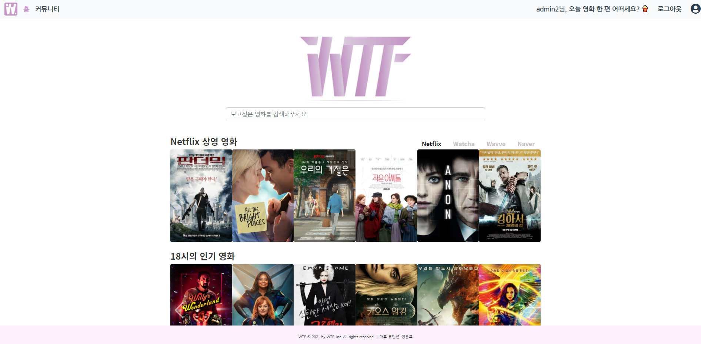
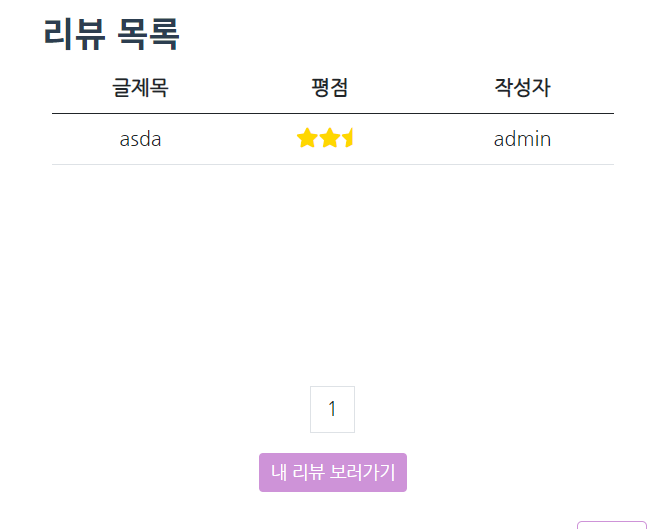
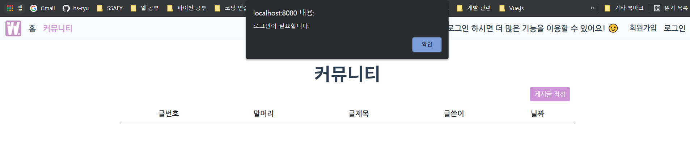
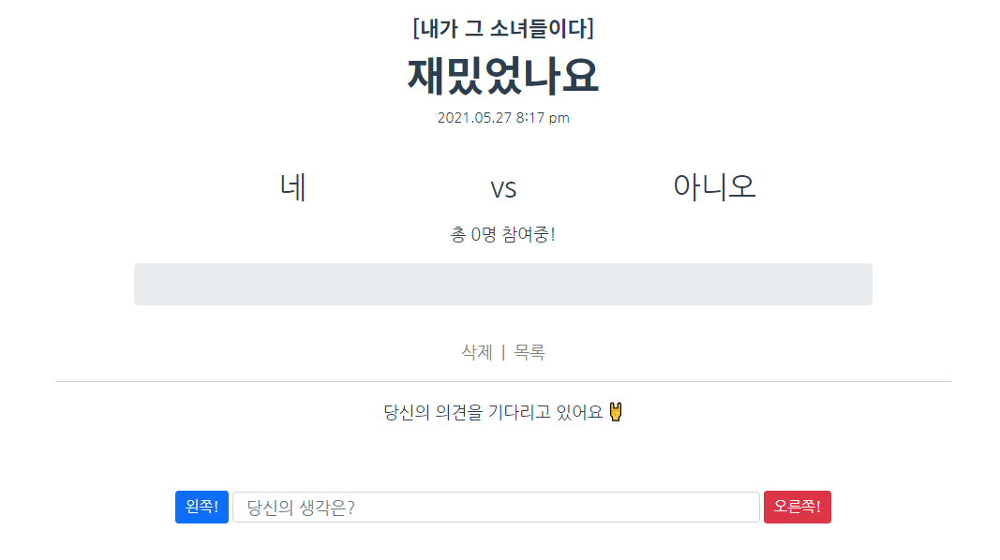

# 관통 프로젝트 (5/20 ~ 5/27)

## 프로젝트 목표

- 영화 정보 기반으로 추천 서비스를 구현한다.
- 사용자들끼리 소통할 수 있는 커뮤니티 서비스를 구성한다.
- 다양한 툴(HTML, CSS, JavaScript, Vue.js, Django, REST API, DataBase)을 활용하여 실제 서비스를 설계해 본다.
- 서비스 관리 및 유지보수를 경험해 본다.

<br>

## 팀원 정보 및 업무 분담 내역

- 나 : 모델 상세 구현 및 url 설정, 시리얼라이징 등 전체적인 백엔드 담당 (5/20 ~ 5/22). 이후 프론트단의 기능도 함께 구현 (영화 상세 페이지의 투표기능, 메인페이지의 영화들 목록에 css효과 넣기 등등등). 

- 페어 : 메인페이지, 커뮤니티, 프로필, 404 에러페이지 등등 대표적인 기능들에 대한 프론트 단을 담당 (5/20 ~ 5/27). 우리가 만든 페이지의 핵심 기능에 대한 아이디어를 냄.  
  -  류현선이 선정한 올해의 페어. 성실함:100% 노력:150%, 끈기:200%, 참여도:300%. 참고로 다른조는 3명이 한팀인 조도 있는데, 전혀 부럽지 않았음. 프로젝트를 끝까지 완성할 수 있었던 건 다 페어인 은교 덕분. 최고최고최고
- 공통 업무 : 컴포넌트별 디자인, 모델링, 디버깅. 추천 알고리즘 구현 등.

<br>

## 프로젝트 설계

#### 1. 대략적인 UI 설계 (05/19)

- 본격적으로 프로젝트에 진입하기 전에, 페어와 함께 어떤 방식으로 페이지를 표현할 것인지 대략적으로 그려봄.
- Figma 사이트를 활용

| 메인페이지                                                   | 영화디테일페이지                                             | 커뮤니티페이지                                               |
| ------------------------------------------------------------ | ------------------------------------------------------------ | ------------------------------------------------------------ |
|  |  |  |

- 만약 우리가 영화 소개, 추천 서비스를 실제로 이용한다면 어떤 화면을 보는것이 좋을 것인지 의논하고, 컨셉을 "최대한 단순하고, 깔금하게 표현하자" 라고 잡았다.

- 아래의 프로젝트 결과와 비교해보면, 완전히 같지는 않지만 우리가 목표했던 느낌대로 디자인이 완성됐음.

| 메인페이지                                                   | 영화디테일페이지                                             | 커뮤니티페이지                                               |
| ------------------------------------------------------------ | ------------------------------------------------------------ | ------------------------------------------------------------ |
|  |  |  |

<br>

#### 2. 모델링 (5/19~5/23)

- 구현하고자 하는 기능의 모델들이 어떤 테이블을 가져야하고, 프론트 단에서 표현하기 위해 어떤 데이터 값을 전달해 줘야하는지 고민하여 전체적인 그림을 그려봄.
- 이전까지 매주 진행했던 프로젝트에서는 모델에 관한 정보도 모두 명세에서 주어졌기 때문에, 모델링을 할 필요가 없어 해야하는 이유에 대해 잘 알지 못했지만, 모델링을 직접 해봄으로써 프로젝트의 흐름을 만들어 볼 수 있었다.
- ERD Cloud 사이트 활용.


<br>

#### 3. 어떤 작업을 할 것인지 결정 

- trello 사이트를 활용하여, 각자 어떤 기능을 구현했고, 구현할 것인지에 대해 명확히 함.
- 혼자 하는 프로젝트가 아니기 때문에, 페어와 상당한 소통이 필요했고(온라인이기 때문에 더 소통에 신경썼다.) 각자 맡은 일을 구체적으로 작성하여 현재 작업 상황이 어떤지 재깍재깍 확인함.


<br>


## 필수 기능에 대한 설명

#### 1. 관리자 뷰


- 관리자로 로그인하면 위 네비게이션 바의 가장 오른쪽에 톱니바퀴 모양이 나옴. 저 버튼을 클릭하면 관리자 페이지로 이동함.


- 관리자 페이지로 이동하면 영화 등록 및 삭제, 업데이트 뿐만 아니라 게시글과 댓글, 유저에 대한 접근이 가능함.


<br>

#### 2. 영화 정보


- 각 유저들은 영화에 대한 평점을 등록, 수정, 삭제가 가능하도록 했으며. 만약 평점을 매겼다면, '리뷰 작성' 버튼이 '내 리뷰 보러가기' 로 바뀜( 즉 한 유저는 하나의 영화에 대해 평점을 한번만 매길 수 있음.)

| 본인의 리뷰는 수정, 삭제가 가능함                            | 하나의 영화에 대해 한사람당 하나의 리뷰만 작성가능           |
| ------------------------------------------------------------ | ------------------------------------------------------------ |
|  |  |


- 만약 로그인 하지 않은 유저가 리뷰를 작성할 시 `로그인이 필요합니다` 라는 경고창을 띄움. 이후, 확인버튼을 누르면 로그인 컴포넌트로 이동.

| 1                                                            | 2                                                            |
| ------------------------------------------------------------ | ------------------------------------------------------------ |
|  |  |

<br>

#### 추천 알고리즘 (현재 시간에 사람들이 가장 많이 찾는 영화를 추천해줌)

- 유저들이 영화를 클릭하게 되면 디테일페이지로 이동함과 동시에, 그 영화에 대한 클릭수를 DB에 저장하여 클릭수가 높은 순서대로 영화를 추천해줌.
- 한 시간마다 클릭수는 0으로 초기화 되고, 사람들은 현재 시간대에 클릭수가 가장 많은 영화들을 볼 수 있게 됨.

```python
@api_view(['GET'])
def getpopularmovies(request):
    now_time = timezone.now()
    movies = get_list_or_404(Movie)
    # 클릭수로 내림차순하여 20개의 영화를 들고옴.
    recommend_movies = Movie.objects.order_by('-clicked')[:20]
    if recommend_movies[0].clicked == 0:
        pass
    # 반복문을 돌면서 한시간 마다 클릭수를 초기화시킴.
    for movie in movies:
        if (now_time.hour > movie.last_cliked_time.hour) or (now_time.day > movie.last_cliked_time.day) or (now_time.month > movie.last_cliked_time.month) or (now_time.year > movie.last_cliked_time.year):
        # if now_time.minute > movie.last_cliked_time.minute:
            movie.last_cliked_time = now_time
            movie.clicked = 0
            movie.save()
    serializer = MovieListSerializer(recommend_movies, many=True)
    return Response(serializer.data)
```


<br>

#### 커뮤니티

- 커뮤니티에서는 로그인한 사용자만 글을 작성할 수 있음.



- 일반 사용자는 건의, 일상 말머리 중 하나를 선택해서 글을 작성할 수 있고, 관리자는 공지사항도 작성이 가능하다.


- 본인의 글에 대해서는 수정, 삭제가 가능하고, 어떤 게시물에 대해서는 댓글도 작성할 수 있다. 댓글을 삭제할 때는 작성자만 삭제가 가능하다.


<br>

## 이외에 작성한 서비스 (목표 서비스)

#### 프로필 페이지

- 프로필 페이지에서는, 팔로워 수, 팔로잉 수 뿐만 아니라 좋아요를 누른 영화와 작성한 리뷰, 작성한 게시글들을 한눈에 확인할 수 있다.
- 또한, 우리는 영화에 좋아요를 누르면 장르 정보를 가지고 와 `선호 장르` 라는 이름으로 그 장르들을 중복 없이 표시해줌. 이 기능으로 인해, 이 사람이 어떤 장르의 영화들을 좋아하는지 확인할 수 있음.


<br>

#### 투표기능

- 어떤 영화에 대해, 어떠한 토론 주제를 가지고 투표를 생성할 수 있고, 로그인 한 유저들은 그 투표에 댓글 작성과 함께 참여할 수 있다.

| 투표 생성                                                    | 투표 하기                                                    | 투표 결과                                                    |
| ------------------------------------------------------------ | ------------------------------------------------------------ | ------------------------------------------------------------ |
|  |  |  |

<br>

#### ★★★★플랫폼 별 상영 영화★★★★

- 페어가 생각해낸 엄청난 기능. 다른 사람들이 구현한 페이지와 우리가 구현한 페이지의 차별성을 줄 수 있는 부분이라고 생각함.
- 현재 가지고 있는 영화들 중에서, 넷플릭스, 왓챠, 웨이브, 네이버에서 실제로 볼 수 있는 영화들을 분류하여 소개해 준다.

| 넷플릭스                                                     | 왓챠                                                         | 웨이브                                                       | 네이버                                                       |
| ------------------------------------------------------------ | ------------------------------------------------------------ | ------------------------------------------------------------ | ------------------------------------------------------------ |
|  |  |  |  |

- 영화 디테일 페이지에 들어가면 현재 상영중인 플랫폼들이 아이콘 형식으로 보이고, 이것들을 클릭하면 각자 해당하는 사이트의 영화를 볼 수 있는 페이지로 이동한다.


<br>

#### 현재 상영중인 영화

- 이틀 전 날짜를 기준으로 상영 중인 영화를 가져와 보여줌.
- 영화 포스터를 클릭하면 예매 가능 정보를 확인할 수 있는 사이트로 이동함.


<br>

#### 사이트 다크모드

- 기본 배경화면에 하얀색이기 때문에, 장기간 화면을 볼 때 눈에 피로감을 줄 수 있다고 생각.
- 다크모드를 사용하여 화면을 반전


## + 알파

#### 어려웠던 부분

- 한번 에러가 나면 디버깅이 쉽지 않았음. 특히나 Vue를 사용하며 라우터로 각 컴포넌트를 연결할 때, 오타 하나가 발생하면 찾기가 굉장히 어려웠음(에러도 안나는 경우).  
- 컴포넌트 설계할 때 어떤식으로 구분지어서 나눠야 할 지 헷갈렸음. 노력과 시간이 필요해 보임.
-  디자인. 어떻게 더 심플하고 이쁘게 보여줄 것인가. 또 그렇게 만들기 위해선 어떤 CSS 요소를 적용해야 하는지가 제일 어려웠다. 기능 구현하는 것 보다 디자인 하는데 시간이 훨씬 더 많이 소요됨.

<br>

#### 관통 프로젝트를 진행하며 느낀점

- 지금까지 배운 모든것을 활용해야했는데, 초기에 배운 내용들(html, css 등)은 잘 기억이 나질 않아 자주 이전 내용들을 확인해야했다.
- Vue를 사용하여 프론트 단을 구현했는데, Vue 수업이 굉장히 타이트 하게 진행되어(내 생각임) 막상 프로젝트에 바로 적용하는게 쉽지는 않았다. 특히 Django와의 연결. 하다보니 감이잡히는 느낌.
- 배운 내용들을 제외하고도, 우리가 원하는 스타일링을 하기 위해 다양한 라이브러리들을 공부하고 설치해야했는데, 이 과정에서 많은 공부가 된 것 같다. 기억에 오래 남을듯.
- 굉장히 시간적으로 타이트 하다고 느꼈음. 실제 실무에서도 정해진 기간내에 개발을 해야한다면 이런 느낌이 아닐까 싶음. 심지어 일찍 시작했음에도 불구하고 시간이 부족하다고 생각했음.
- 같이 머리싸매고 고생한 페어 은교야. 너무 수고많았고 고마웠다.

<br>

#### 아쉬운점 & 추후 구현해볼 기능

- 실제로 사이트를 이용하는데에는 문제가 없는데(로컬에서), 특정 페이지의 콘솔창에서 String - Number간의 관계에 대한 오류 메시지가 계속발생했다. 부가적으로 해결해 보고 싶은 부분.

- 관리자 아이디로 로그인하면 관리자 페이지(영화삭제가능, 리뷰 삭제 가능, 회원 삭제 가능)로 이동할 수 있도록 했지만, 그 관리자 페이지를 이쁘게 디자인 하지는 못했다. 현재 우리 사이트의 느낌과 비슷하게 꾸며보고싶음.
- 내가 CSS에 대한 이해도가 조금만 더 높았더라도 많은 시간을 절약할 수 있었을 것이다. 

